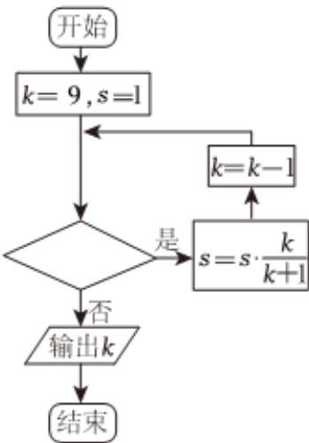

<!-- question-source:start -->
8、执行如图所示的程序框图，若输出 $k$ 的值为6，则判断框内可填入的条件是（）

A $S > \frac{1}{2}$ B $S > \frac{3}{5}$ C $S > \frac{7}{10}$ D $S > \frac{4}{5}$
<!-- question-source:end -->

![[Q00090190A1]]
