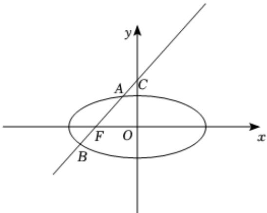

> [!faq]- 2020-2021学年内蒙古包头四中高二（下）月考数学试卷（理科）（4月份）解析
>
> > [!success]- **【答案】** A
>
> > [!note]- **【解析】**
> > 如图所示：
> >
> > 
> >
> > 对直线 $x-y+1=0$ ，
> >
> > 令x=0，解得y=1，
> >
> > 令y=0，解得x=-1，
> >
> > 故 $F(-1,0)$ ， $C(0,1)$ ，
> >
> > 则 $\overline{FC} = (1, 1)$
> >
> > 设 $A(x_{0},y_{0})$ ，则 $\overrightarrow{AC}=(-x_{0},1-y_{0})$ ，
> >
> > 而 $\overrightarrow{FC} = 2\overrightarrow{AC}$ ，则 $\left\{ \begin{array}{c} - 2x_0 = 1\\ 2(1 - y_0) = 1 \end{array} \right.$
> >
> > 解得 $\left\{ \begin{array}{l} x_0 = -\frac{1}{2} \\ y_0 = \frac{1}{2} \end{array} \right.$
> >
> > 点A又在椭圆上，
> >
> > 所以 $\frac{(-\frac{1}{2})^2}{a^2} +\frac{(\frac{1}{2})^2}{b^2} = 1$ ， $(c = 1,a^{2} = b^{2} + c^{2})$
> >
> > 整理得 $4a^{4}-4a^{2}=2a^{2}-1$
> >
> > 所以 $a^{2}=\frac{3+\sqrt{5}}{4}$ ，
> >
> > 所以 $e = \frac{c}{a} = \sqrt{\frac{4}{3 + \sqrt{5}}} = \sqrt{3 - \sqrt{5}} = \sqrt{\frac{12 - 4\sqrt{5}}{4}} = \sqrt{\frac{(\sqrt{10} - \sqrt{2})^2}{4}} = \frac{\sqrt{10} - \sqrt{2}}{2}$ . 故选： $A$ .
