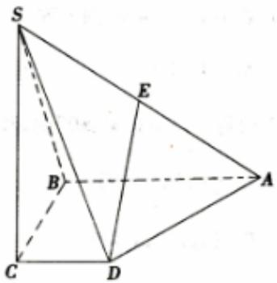

<!-- question-source:start -->
5、四棱锥S-ABCD中， $SC \perp$ 平面ABCD，AB//CD， $AB \perp BC$ ， $SC = AB = BC = 2CD$ ，E是SA的中点。

1 证明： $DE \parallel$ 平面SBC。

2 求平面SBC与平面SAD所成二面角的正弦值。
<!-- question-source:end -->

![[Q00090270A1]]
