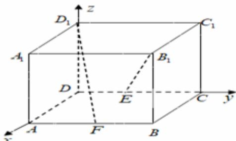

> [!faq]- 2020-2021学年内蒙古包头市高二上学期数学（理）期末教学质量检测试卷（A）解析
>
> > [!success]- **【答案】** B
>
> > [!note]- **【解析】**
> > 以D为坐标原点，DA，DC， $DD_{1}$ 所在的直线分别为x轴，y轴，z轴，建立如图所示的空间直角坐标系，
> >
> > 
> >
> > 则 $D_{1}(0,0,1),B_{1}(1,2,1),E(0,1,0),F(1,1,0)$
> >
> > 所以 $\overrightarrow{B_1E} = (-1, - 1, - 1),\overrightarrow{D_1F} = (1,1, - 1),$
> >
> > 所以 $\cos < \overrightarrow{B_1E}$ , $\overrightarrow{D_1F} > = \frac{\overrightarrow{B_1E} \cdot \overrightarrow{D_1F}}{\left|\overrightarrow{B_1E}\right| \cdot \left|\overrightarrow{D_1F}\right|} = \frac{-1 - 1 + 1}{\sqrt{3} \times \sqrt{3}} = -\frac{1}{3}$ 。
> >
> > 因为异面直线所成角的范围为 $\left(0, \frac{\pi}{2}\right]$
> >
> > 所以异面直线 $B_{1}E$ 与 $D_{1}F$ 所成角的余弦值为 $\frac{1}{3}$ 。
> >
> > 故选：B。
