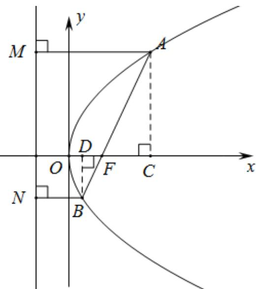

> [!faq]- 2020-2021学年内蒙古包头市高二上学期数学（理）期末教学质量检测试卷（A）解析
>
> > [!success]- **【答案】** A
>
> > [!note]- **【解析】**
> > 如图，过点A、B分别作AM、BN垂直于抛物线 $y^{2}=2px(p>0)$ 的准线，垂足分别为M、N，过点A、B分别作x轴的垂线AC、BD，垂足分别为C、D，
> >
> > 
> >
> > 由抛物线的性质，得： $|AF| = |AM|$ ， $|BF| = |BN|$ ，
> >
> > 由已知可知：直线AB的斜率为k（k>0），设其倾斜角为 $\theta(0<\theta<\frac{\pi}{2})$ ，则 $k=\tan\theta$ ，
> >
> > 在 $Rt\triangle ACF$ 中， $\cos \theta = \frac{|FC|}{|AF|} = \frac{|AM| - p}{|AF|} = \frac{|AF| - p}{|AF|}$
> >
> > $$
> > \therefore | A F | = \frac {p}{1 - \cos \theta}
> > $$
> >
> > 在 $Rt\triangle BDF$ 中， $\cos \theta = \frac{|FD|}{|BF|} = \frac{p - |BN|}{|BF|} = \frac{p - |BF|}{|BF|}$
> >
> > $$
> > \therefore | B F | = \frac {p}{1 + \cos \theta}
> > $$
> >
> > $$
> > \because \left| \overrightarrow {A F} \right| = 3 \left| \overrightarrow {B F} \right|
> > $$
> >
> > $\therefore \frac{p}{1 - \cos\theta} = \frac{3p}{1 + \cos\theta}$ 即 $1 + \cos \theta = 3(1 - \cos \theta)$
> >
> > 解得： $\cos \theta = \frac{1}{2}$
> >
> > $$
> > \because 0 <   \theta <   \frac {\pi}{2}
> > $$
> >
> > $\therefore \theta = \frac{\pi}{3}$
> >
> > $$
> > \therefore k = \tan \frac {\pi}{3} = \sqrt {3} 。
> > $$
> >
> > 故选：A。
