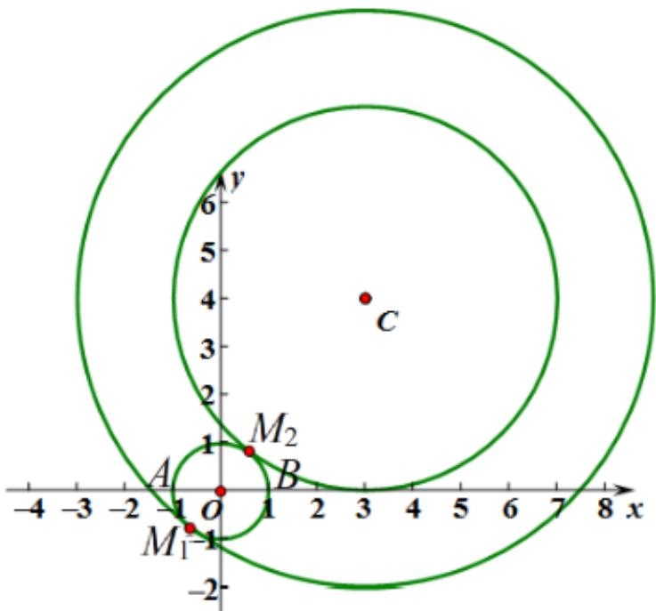

> [!faq]- 2020-2021学年内蒙古包头市高二上学期数学（理）期末教学质量检测试卷（A）解析
>
> > [!success]- **【答案】** A
>
> > [!note]- **【解析】**
> > 如图所示：
> >
> > 
> >
> > 要使 $\angle AMB=90^{\circ}$ ,
> >
> > 则点M在以AB为直径的圆上（不包含点A和点B），
> >
> > 因为AB的中点为O，所以可记以AB为直径的圆为 $\odot O$ ，
> >
> > 而点M又在 $\odot C$ 上，所以M是 $\odot C$ 与 $\odot O$ 的交点，
> >
> > 即要求 $\odot C$ 与 $\odot O$ 有异于点A和点B的公共点。
> >
> > 由题意可知， $\odot O$ 的半径 $r = 1$ ， $\odot C$ 半径 $\mathbb{R}(R > 0)$ ，
> >
> > 两圆心间的距离 $|OC|=\sqrt{3^{2}+4^{2}}=5,$
> >
> > 两圆内切时有 $|OC|=R-1=5,R=6$ ,
> >
> > 显然此时的切点 $M_{1}$ 不与点A或点B重合，符合题意；
> >
> > 两圆外切时有 $|OC|=R+1=5,R=4$
> >
> > 显然此时的切点 $M_{2}$ 不与点A或点B重合，符合题意；
> >
> > 当 $4 < R < 6$ 时， $\odot C$ 与 $\odot O$ 有两个不同的公共点，
> >
> > 假设点A和点B是 $\odot C$ 与 $\odot O$ 的公共点，
> >
> > 则点C必在y轴上，矛盾，所以点A和点B不可能同时是⊙C与⊙O的公共点，
> >
> > 所以当 $\odot C$ 经过点B时， $\odot C$ 与 $\odot O$ 有异于点A和点B的公共点，
> >
> > 当 $\odot C$ 经过点A时， $\odot C$ 与 $\odot O$ 也有异于点A和点B的公共点，
> >
> > 所以4<R<6符合题意。
> >
> > 综上可知，符合题意的R的取值范围是[4，6]。
> >
> > 故选：A。
