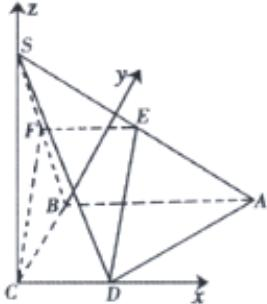

> [!faq]- 2020-2021学年内蒙古包头市高二上学期数学（理）期末教学质量检测试卷（A）解析
>
> > [!success]- **【答案】** 详见解析 1
>
> > [!note]- **【解析】**
> > 
> >
> > 以C为原点，分别以CD，CB，CS所在直线为x，y，z轴
> > 建立如图所示的空间直角坐标系C-xyz。
> > 设CD=1，则SC=BC=AB=2，
> > 于是D(1,0,0)，A(2,2,0)，S(0,0,2)， $\overrightarrow{DA}=(1,2,0),\overrightarrow{DS}=(-1,0,2)$ 。
> > 设平面SAD的一个法向量为 $\overrightarrow{n}=(x,y,z)$ ，
> > 则 $\left\{\begin{aligned}\overrightarrow{n}\cdot\overrightarrow{DA}&=x+2y=0\\ \overrightarrow{n}\cdot\overrightarrow{DS}&=-x+2z=0\end{aligned}\right.$ ，令x=2，得 $\overrightarrow{n}=(2,-1,1)$ ，
> > 取平面SBC的一个法向量为 $\overrightarrow{m}=(1,0,0)$ 。
> > 设平面SBC与平面SAD所成二面角大小为 $\theta$ ，
> > 则 $|\cos\theta|=\left|\cos<\overrightarrow{m},\overrightarrow{n}>\right|=\frac{|\overrightarrow{m}\cdot\overrightarrow{n}|}{|\overrightarrow{m}||\overrightarrow{n}|}=\frac{|2+0+0|}{\sqrt{1}\times\sqrt{4+1+1}}=\frac{2}{\sqrt{6}}$ 又因为 $\theta\in[0,\pi]$ ，所以 $\sin\theta=\frac{\sqrt{3}}{3}$ 。
> > 故平面SBC与平面SAD所成二面角的正弦值为 $\frac{\sqrt{3}}{3}$ 。
