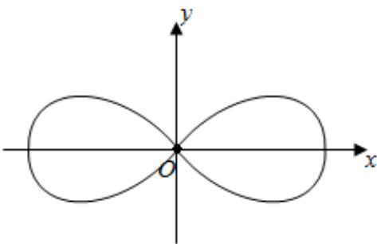

<!-- question-source:start -->
6、

在平面直角坐标系 $xOy$ 中，曲线 $C_1$ 的参数方程为

$\left\{ \begin{array}{l} x = r \cos \alpha \\ y = r \sin \alpha \end{array} \right.$ （ $0 < r < 2$ ， $\alpha$ 为参数），以 $O$ 为极点， $x$ 轴的非负半轴为极轴建立极坐标系，曲线 $C_2: \rho^2 = 4 \cos 2\theta$ （如图所示）。

1 若 $r = \sqrt{2}$ ，求曲线 $C_1$ 的极坐标方程，并求曲线 $C_1$ 与 $C_2$ 交点的直角坐标；

2

已知曲线 $C_2$ 既关于原点对称，又关于坐标轴对称，且曲线 $C_1$ 与 $C_2$ 交于不同的四点 $\mathbf{A},\mathbf{B},\mathbf{C},\mathbf{D}$ ，求矩形ABCD面积的最大值.
<!-- question-source:end -->

![[Q00090226A1]]
