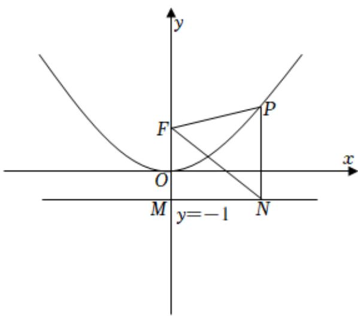

> [!faq]- 2021-2022学年内蒙古包头市高二（上）期末数学试卷（文科）解析
>
> > [!success]- **【答案】** C
>
> > [!note]- **【解析】**
> > 由题意如图所示，设准线与y轴交于M点，
> >
> > 由抛物线的性质可得 $|PN|=|PF|$ ，而 $\angle PNF=60^{\circ}$ ，
> >
> > 所以 $\triangle PFN$ 为等边三角形，
> >
> > 由抛物线的方程可得准线方程为 $y = -1$ ， $|FM| = p = 2$
> >
> > $\angle FNM = 30^{\circ}$ ，所以 $|FN| = \frac{|FM|}{sin30^{\circ}} = \frac{2}{\frac{1}{2}} = 4$
> >
> > 所以 $S_{\triangle PNF}=\frac{\sqrt{3}}{4}\times4^{2}=4\sqrt{3}$ ,
> >
> > 故选：C.
> >
> > 
