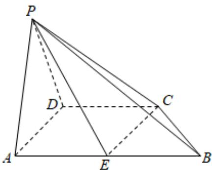

<!-- question-source:start -->
3. 在四棱锥 $P - ABCD$ 中, $AB \parallel CD$ , $AB = 2CD = 2BC = 2AD = 2$ , $\angle DAB = 60^{\circ}$ , $AE = BE$ , $\triangle PAD$ 为正三角形, 且平面 $PAD \perp$ 平面 $ABCD$ .

1 求二面角 $P - EC - B$ 的余弦值；

2

线段 $PB$ 上是否存在一点 $M$ （不含端点），使得异面直线 $DM$ 和 $PE$ 所成的角的余弦值为 $\frac{\sqrt{6}}{4}$ ？若存在，指出点 $M$ 的位置；若不存在，请说明理由.
<!-- question-source:end -->

![[Q00092133A1]]
