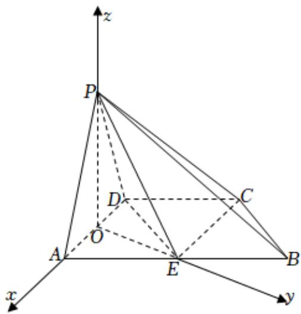

> [!faq]- 2021-2022学年内蒙古包头市高二（上）期末数学试卷（理科）解析
>
> > [!success]- **【答案】** 详见解析
>
> > [!note]- **【解析】**
> > 详见解析
> >
> > 设O是AD中点， $\triangle PAD$ 为正三角形，则 $PO\perp AD$ .
> >
> > 因为平面 $PAD \perp$ 平面ABCD，平面 $PAD \cap$ 平面ABCD = AD， $PO \subset$ 平面PAD，
> >
> > 所以 $PO \perp$ 面ABCD.
> >
> > 又因为 $AD = AE = 1, \angle DAB = 60^{\circ}$
> >
> > 所以 $\triangle ADE$ 为正三角形，所以 $OE\perp AD$ ，
> >
> > 建立如图所示空间直角坐标系O-xyz，
> >
> > 则 $P(0, 0, \frac{\sqrt{3}}{2})$ ， $E(0, \frac{\sqrt{3}}{2}, 0)$ ， $C(-1, \frac{\sqrt{3}}{2}, 0)$ ， $D(-\frac{1}{2}, 0, 0)$ ， $B(-\frac{1}{2}, \sqrt{3}, 0)$
> >
> > $$
> > \overrightarrow {P C} = (- 1, \frac {\sqrt {3}}{2}, - \frac {\sqrt {3}}{2}), \overrightarrow {P E} = (0, \frac {\sqrt {3}}{2}, - \frac {\sqrt {3}}{2})
> > $$
> >
> > $$
> > , \overrightarrow {D P} = (\frac {1}{2}, 0, \frac {\sqrt {3}}{2}).
> > $$
> >
> > (1)设平面PEC的法向量为 $\overrightarrow{n_{1}}=(x,y,z)$ ,由 $\left\{ \begin{array}{l} \overrightarrow{PC} \bullet \overrightarrow{n_1} = 0, \\ \overrightarrow{PE} \bullet \overrightarrow{n_1} = 0, \end{array} \right.$ 即 $\left\{ \begin{array}{l} -x + \frac{\sqrt{3}}{2} y - \frac{\sqrt{3}}{2} z = 0, \\ \frac{\sqrt{3}}{2} y - \frac{\sqrt{3}}{2} z = 0, \end{array} \right.$ 可取 $\overrightarrow{n_1} = (0, 1, 1)$ .
> >
> > 平面 $EBC$ 的一个法向量为 $\overrightarrow{n_2} = (0, 0, 1)$ ，所以
> >
> > $$
> > \cos \langle \overrightarrow {n _ {1}}, \overrightarrow {n _ {2}} \rangle = \frac {\overrightarrow {n _ {1}} \bullet \overrightarrow {n _ {2}}}{| \overrightarrow {n _ {1}} | \bullet | \overrightarrow {n _ {2}} |} = \frac {\sqrt {2}}{2},
> > $$
> >
> > 
> >
> > 又由图可得二面角 $P - EC - B$ 为钝角，
> >
> > 所以二面角 $P - EC - B$ 的余弦值为 $-\frac{\sqrt{2}}{2}$ .
> >
> > (2)设 $\overrightarrow{PM} = \lambda \overrightarrow{PB}(0 < \lambda < 1)$ ，则 $\overrightarrow{PM} = (-\frac{1}{2}\lambda, \sqrt{3}\lambda, -\frac{\sqrt{3}}{2}\lambda)$ ，
> >
> > $$
> > \overrightarrow {D M} = \overrightarrow {D P} + \overrightarrow {P M} = \left(\frac {1}{2} - \frac {1}{2} \lambda , \sqrt {3} \lambda , \frac {\sqrt {3}}{2} - \frac {\sqrt {3}}{2} \lambda\right), \overrightarrow {P E} = \left(0, \frac {\sqrt {3}}{2}, - \frac {\sqrt {3}}{2}\right),
> > $$
> >
> > $$
> > | c o s \langle \overrightarrow {D M}, \overrightarrow {P E} \rangle | = \frac {| \overrightarrow {D M} \bullet \overrightarrow {P E} |}{| \overrightarrow {D M} | | \overrightarrow {P E} |} = \frac {| 9 \lambda - 3 |}{2 \sqrt {6} \bullet \sqrt {4 \lambda^ {2} - 2 \lambda + 1}} = \frac {\sqrt {6}}{4}
> > $$
> >
> > 解得 $\lambda = \frac{4}{5}$ 或0（舍），所以存在点 $M$ 使得 $\overrightarrow{PM} = \frac{4}{5}\overrightarrow{PB}$ .
