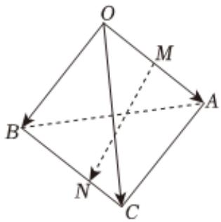

> [!faq]- 2022-2023学年内蒙古包头一中高二（上）期中数学试卷（理科）解析
>
> > [!success]- **【答案】** 详见解析
>
> > [!note]- **【分析】**
> > 本题未单列分析。
>
> > [!note]- **【解析】**
> > 【答案】
> >
> > 如图，
> >
> > 依题意， $\overrightarrow{BN} = 2\overrightarrow{NC}$
> >
> > 由 $\overrightarrow{OB} = \overrightarrow{b}$ ， $\overrightarrow{OC} = \overrightarrow{c}$ ，可得
> >
> > $$
> > \overrightarrow {O N} = \overrightarrow {O C} + \overrightarrow {C N} = \overrightarrow {O C} + \frac {1}{3} \overrightarrow {C B} = \overrightarrow {O C} + \frac {1}{3} (\overrightarrow {O B} - \overrightarrow {O C}) = \frac {1}{3} \overrightarrow {O B}
> > $$
> >
> > $$
> > + \frac {2}{3} \overrightarrow {O C} = \frac {1}{3} \overrightarrow {b} + \frac {2}{3} \overrightarrow {c}
> > $$
> >
> > ∵ M 为 OA 中点，则 $\overrightarrow{OM} = \frac{1}{2}\overrightarrow{OA} = \frac{1}{2}\overrightarrow{a}$
> >
> > $\therefore \overrightarrow{MN} = \overrightarrow{ON} -\overrightarrow{OM} = \overrightarrow{ON} -\frac{1}{2}\overrightarrow{OA} = -\frac{1}{2}\overrightarrow{a} +\frac{1}{3}\overrightarrow{b} +\frac{2}{3}\overrightarrow{c}.$
> >
> > 
> >
> > 故选：D.
