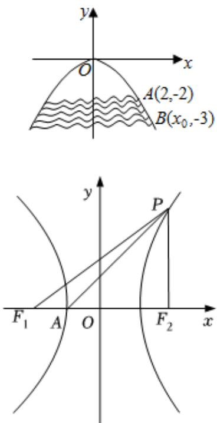

> [!faq]- 2022-2023学年内蒙古包头一中高二（上）期中数学试卷（理科）解析
>
> > [!success]- **【答案】** ①③
>
> > [!note]- **【解析】**
> > 若 $m > n > 0$
> >
> > 则 $\frac{1}{m} < \frac{1}{n}$
> >
> > 
> >
> > 由椭圆的定义可知， $\frac{x^2}{\frac{1}{m}} +\frac{y^2}{\frac{1}{n}} = 1$ 表示焦点在 $y$ 轴上的椭圆，故命题 $p_1$ 为真命题，
> >
> > $$
> > m = n > 0
> > $$
> >
> > 则方程为 $x^{2} + y^{2} = \frac{1}{n}$ ，表示圆心为 $(0,0)$ ，半径为 $\frac{1}{\sqrt{n}}$ 的圆，故 $p_2$ 为假命题，
> >
> > $$
> > m <   0, n > 0
> > $$
> >
> > 则方程为 $\frac{x^2}{\frac{1}{m}} +\frac{y^2}{\frac{1}{n}} = 1$ 表示焦点在 $y$ 轴上的双曲线，
> >
> > 故此时渐近线方程为 $y=\pm\sqrt{-\frac{m}{n}}x$ ，
> >
> > 若 $m > 0, n < 0$
> >
> > 则方程为 $\frac{x^2}{\frac{1}{m}} +\frac{y^2}{\frac{1}{n}} = 1$ ，表示焦点在 $x$ 轴上的双曲线，
> >
> > 故此时的渐近线方程为 $y = \pm \sqrt{-\frac{m}{n}} x$ ，故 $p_3$ 为真命题，
> >
> > 当 $m = 0, n > 0$
> >
> > 则方程为 $y = \pm \frac{1}{\sqrt{n}}$ ，表示两条直线，故 $p_4$ 为真命题，
> >
> > ① $p_{1}\vee p_{4}$ 为真命题，② $p_{1}\wedge p_{2}$ 为假命题，③ $\neg p_{2}\wedge p_{3}$ 为真命题，④ $\neg p_{3}\vee\neg p_{4}$ 为假命题.
