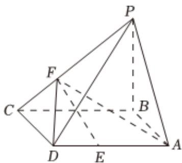

<!-- question-source:start -->
3. 如图所示，四棱锥 $P - ABCD$ 的底面ABCD是矩形， $PB \perp$ 底面ABCD， $AB = BC = 3, BP = 3, CF = \frac{1}{3} CP, DE = \frac{1}{3} DA.$

1 证明：平面 $EFA \perp$ 平面 $ABP$ ；

2 求直线PC与平面ADF所成角的正弦值.
<!-- question-source:end -->

![[Q00092131A1]]
