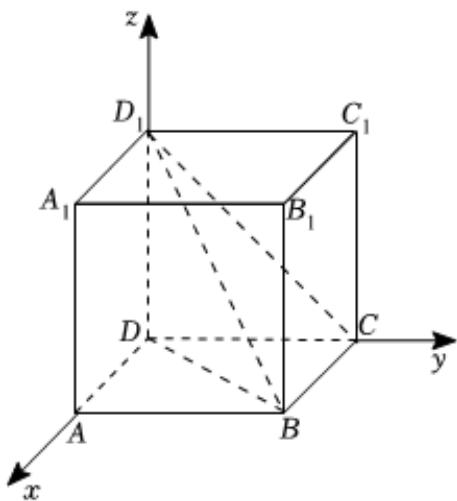

> [!faq]- 2022-2023学年内蒙古包头六中高二（上）期末数学试卷（理科）解析
>
> > [!success]- **【答案】** $60^{\circ}$
>
> > [!note]- **【解析】**
> > 在正方体 $ABCD - A_{1}B_{1}C_{1}D_{1}$ 中，令棱长 $AB = 1$ ，建系如图，
> >
> > $$
> > D (0, 0, 0), B (1, 1, 0), C (0, 1, 0), D _ {1} (0, 0, 1)
> > $$
> >
> > $$
> > \therefore \overrightarrow {D B} = (1, 1, 0), \overrightarrow {D D _ {1}} = (0, 0, 1), \overrightarrow {C B} = (1, 0, 0)
> > $$
> >
> > $$
> > , \overrightarrow {C D _ {1}} = (0, - 1, 1)
> > $$
> >
> > 令平面 $DD_{1}B$ 的法向量 $\overrightarrow{n}=(x,y,z)$ ,
> >
> > 则 $\left\{ \begin{array}{l} \overrightarrow{n} \cdot \overrightarrow{DB} = x + y = 0 \\ \overrightarrow{n} \cdot \overrightarrow{DD_1} = z = 0 \end{array} \right.$ ，取 $\overrightarrow{n} = (1, -1, 0)$ ，
> >
> > 令平面 $CD_{1}B$ 的法向量 $\overrightarrow{m}=(x_{1},y_{1},z_{1})$ ,
> >
> > 则 $\left\{ \begin{array}{l} \overrightarrow{m} \cdot \overrightarrow{CD_1} = -y_1 + z_1 = 0 \\ \overrightarrow{m} \cdot \overrightarrow{CB} = x_1 = 0 \end{array} \right.$ ，取 $\overrightarrow{m} = (0, 1, 1)$ ，
> >
> > 
> >
> > $$
> > \therefore \cos \langle \overrightarrow {n}, \overrightarrow {m} \rangle = \frac {\overrightarrow {n} \cdot \overrightarrow {m}}{| \overrightarrow {n} | | \overrightarrow {m} |} = \frac {- 1}{\sqrt {2} \times \sqrt {2}} = - \frac {1}{2},
> > $$
> >
> > $\therefore \langle \overrightarrow{n},\overrightarrow{m}\rangle = 120^{\circ}$ ，又由图形知，二面角 $C - D_{1}B - D$ 的平面角为锐角，
> >
> > ∴二面角 $C-D_{1}B-D$ 的大小 $60^{\circ}$ .
> >
> > 故答案为： $60^{\circ}$
