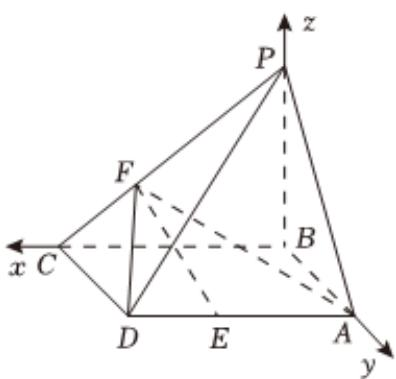

> [!faq]- 2022-2023学年内蒙古包头六中高二（上）期末数学试卷（理科）解析
>
> > [!success]- **【答案】** 详见解析
>
> > [!note]- **【解析】**
> > 详见解析
> >
> > (1)证明：已知四棱锥P-ABCD的底面ABCD是矩形，PB⊥底面ABCD，
> > 则PB⊥AE，
> > 又AE⊥AB，
> > 则AE⊥平面ABP，
> > 又AE⊂平面EFA，
> > 则平面EFA⊥平面ABP；
> >
> > (2)建立如图所示的空间直角坐标系，
> >
> > 
> >
> > $$
> > A B = B C = 3, B P = 3, C F = \frac {1}{3} C P, D E = \frac {1}{3} D A
> > $$
> >
> > 则 $B(0,0,0)$ ， $A(0,3,0)$ ， $C(3,0,0)$ ， $E(2,3,0)$ ， $F(2,0,1)$ ， $P(0,0,3)$ ， $D(3,3,0)$
> >
> > 设 $\overrightarrow{n} = (x, y, z)$ 为平面 $ADF$ 的一个法向量，
> >
> > $$
> > \left\{ \begin{array}{l} \overrightarrow {n} \bullet \overrightarrow {F A} = 0 \\ \overrightarrow {n} \bullet \overrightarrow {A D} = 0 \end{array} \right.
> > $$
> >
> > $$
> > \left\{ \begin{array}{l} - 2 x + 3 y - z = 0 \\ 3 x = 0 \end{array} \right.
> > $$
> >
> > 令y=1，
> >
> > 则x=0,z=3,
> >
> > 即 $\overrightarrow{n} = (0, 1, 3)$
> >
> > 又 $\overrightarrow{PC} = (3, 0, -3)$ ,
> >
> > $$
> > | \cos <   \overrightarrow {n}, \overrightarrow {P C} > = \frac {\overrightarrow {n} \bullet \overrightarrow {P C}}{| \overrightarrow {n} | | \overrightarrow {P C} |} = \frac {- 9}{\sqrt {1 0} \times 3 \sqrt {2}} = - \frac {3 \sqrt {5}}{1 0},
> > $$
> >
> > 设直线PC与平面ADF所成角为 $\theta$ ，
> >
> > $$
> > \left| \sin \theta = \left| \cos <   \overrightarrow {n}, \overrightarrow {P C} > \right| = \frac {3 \sqrt {5}}{1 0} \right.
> > $$
> >
> > 即直线PC与平面ADF所成角的正弦值为 $\frac{3\sqrt{5}}{10}$ .
