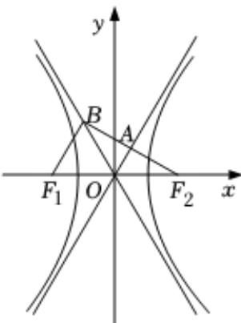

<!-- question-source:start -->
11、如图， $F_{1}$ ， $F_{2}$ 是双曲线 $C:\frac{x^{2}}{a^{2}}-\frac{y^{2}}{3}=1(a>0)$ 的左、右焦点，过 $F_{2}$ 的直线与双曲线C的两条渐近线分别交于A，B两点，若点A为 $F_{2}B$ 的中点，且 $F_{1}B\perp F_{2}B$ ，则 $|F_{1}F_{2}|=(\quad)$

$$
4 \sqrt {3}
$$

C 6
D 9
<!-- question-source:end -->

![[Q00090321A1]]
