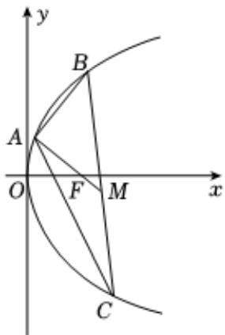

<!-- question-source:start -->
2. 已知点 $A(2,8)$ ， $B(x_1,y_1)$ ， $C(x_2,y_2)$ 都在抛物线 $y^2 = 2px$ 上， $\triangle ABC$ 的重心与此抛物线的焦点 $F$ 重合（如图）

1 写出该抛物线的方程和焦点 $F$ 的坐标；

2 求线段BC中点M的坐标.
<!-- question-source:end -->

![[Q00092135A1]]
