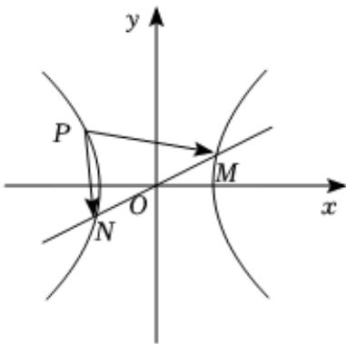

> [!faq]- 2022-2023学年内蒙古包头四中高二（上）期末数学试卷（文科）解析
>
> > [!success]- **【答案】** C
>
> > [!note]- **【解析】**
> > 如图，由题可得O点是MN中点，
> >
> > 则 $|\overrightarrow{PM} +\overrightarrow{PN}| = 2|\overrightarrow{PO}$
> >
> > 则当 $P$ 点在双曲线顶点处时， $\vert \overrightarrow{PO}\vert$ 最小，
> >
> > 即有 $|\overrightarrow{PM} +\overrightarrow{PN}| = 2|\overrightarrow{PO} |\geqslant 2$
> >
> > 故选：C.
> >
> > 
