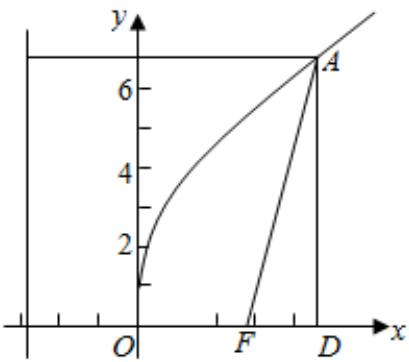

> [!faq]- 2022-2023学年内蒙古包头四中高二（上）期末数学试卷（文科）解析
>
> > [!success]- **【答案】** B
>
> > [!note]- **【解析】**
> > 过 $A$ 作 $AD \perp x$ 轴于 $D$ ，令 $FD = m$ ，则 $FA = 2m$ ，即 $A$ 到准线的距离为 $2m$ ，由抛物线的定义可得 $p + m = 2m$ ，即 $m = p$ . $\therefore OA = \sqrt{\left(\frac{p}{2} + p\right)^2 + (\sqrt{3}p)^2} = \frac{\sqrt{21}}{2} p.$
> >
> > 故选：B.
> >
> > 
