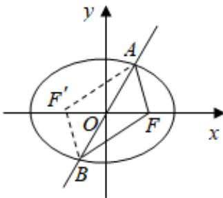

> [!faq]- 2022-2023学年内蒙古包头四中高二（上）期末数学试卷（文科）解析
>
> > [!success]- **【答案】** A
>
> > [!note]- **【解析】**
> > 如图所示，设 $F'$ 为椭圆的左焦点，连接 $AF'$ ， $BF'$ ，则四边形 $AFBF'$ 是平行四边形，
> >
> > $$
> > \therefore 4 = | A F | + | B F | = \left| A F ^ {\prime} \right| + | A F | = 2 a, \therefore a = 2.
> > $$
> >
> > 取 $M(0,b)$ ，∵点 $M$ 到直线 $\pmb{l}$ 的距离不小于 $\frac{4}{5}$ ，∴ $\frac{|4b|}{\sqrt{3^2 + 4^2}}\geq \frac{4}{5}$ ，解得 $b\geqslant 1.$
> >
> > $$
> > \therefore e = \frac {c}{a} = \sqrt {1 - \frac {b ^ {2}}{a ^ {2}}} \leqslant \sqrt {1 - \frac {1}{2 ^ {2}}} = \frac {\sqrt {3}}{2}.
> > $$
> >
> > 
> >
> > $\therefore$ 椭圆 $\pmb{E}$ 的离心率的取值范围是 $(0, \frac{\sqrt{3}}{2} ]$ .
> >
> > 故选：A.
