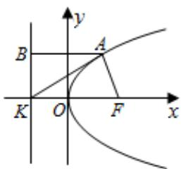

> [!faq]- 2022-2023学年内蒙古包头四中高二（上）期末数学试卷（文科）解析
>
> > [!success]- **【答案】** B
>
> > [!note]- **【解析】**
> > $\because$ 抛物线 $C:y^{2} = 8x$ 的焦点为 $F(2,0)$ ，准线为 $\pmb {x} = -2$
> >
> > $$
> > \therefore K (- 2, 0)
> > $$
> >
> > 设 $A(x_0, y_0)$ ，过 $A$ 点向准线作垂线 $AB$ ，则 $B(-2, y_0)$
> >
> > $\because |AK| = \sqrt{2} |AF|$ ，又 $AF = AB = x_0 - (-2) = x_0 + 2$
> >
> > ∴由 $BK^{2}=AK^{2}-AB^{2}$ 得 $y_{0}^{2}=(x_{0}+2)^{2}$ ，即 $8x_{0}=(x_{0}+2)^{2}$ ，解得 $A(2,\pm4)$
> >
> > $\therefore \triangle AFK$ 的面积为 $\frac{1}{2} |KF| \bullet |y_0| = \frac{1}{2} \times 4 \times 4 = 8$
> >
> > 
> >
> > 故选：B.
