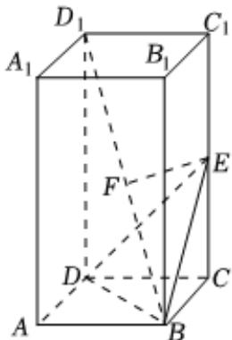

<!-- question-source:start -->
2. 

$$
A B C D - A _ {1} B _ {1} C _ {1} D _ {1}. A B = 1
$$

$$
A A _ {1} = 2
$$

$$
C C _ {1}
$$

点F为 $BD_{1}$ 中点.

1 证明 $EF$ 为 $BD_{1}$ 与 $CC_{1}$ 的公垂线；

2 求点 $D_{1}$ 到面BDE的距离.
<!-- question-source:end -->

![[Q00091558A1]]
