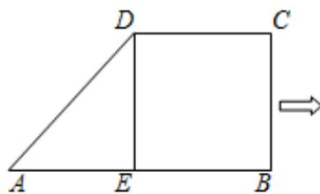
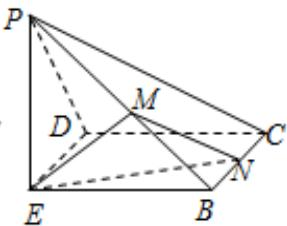

<!-- question-source:start -->
3、如图，在直角梯形ABCD中， $AB//DC$

$\angle ABC = 90^{\circ}$ , AB = 2DC = 2BC, E为AB的中点，沿DE将 $\triangle ADE$ 折起，使得点A到点P位置，且PE⊥EB, M为PB的中点，N是BC上的动点（与点B, C不重合）。

( I ) 求证：平面EMN⊥平面PBC；

（Ⅱ）是否存在点N，使得二面角B-EN-M的余弦值 $\frac{\sqrt{6}}{6}$ ？若存在，确定N点位置；若不存在，说明理由.
<!-- question-source:end -->

![[Q00091559A1]]
