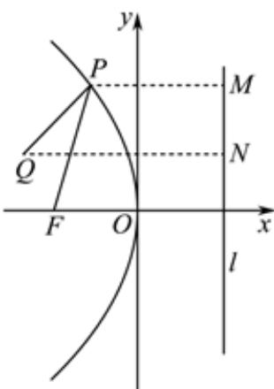

> [!faq]- 2022-2023学年内蒙古包头四中高二（上）期末数学试卷（理科）解析
>
> > [!success]- **【答案】** C
>
> > [!note]- **【解析】**
> > 抛物线 $C:y^{2} = -12x$ 的焦点为 $F(-3,0)$ ，准线 $\pmb{l}$ 的方程为 $\pmb{x} = 3$ 如图，过 $P$ 作 $PM\bot l$ 于 $M$ ，
> >
> > 
> >
> > 由抛物线的定义可知 $|PF|=|PM|$ ，所以 $|PF|+|PQ|=|PM|+|PQ|$ 则当Q，P，M三点共线时， $|PM|+|PQ|$ 最小为3-(-4)=7.
> >
> > 所以 $|PF|+|PQ|$ 的最小值为7.
> >
> > 故选：C.
