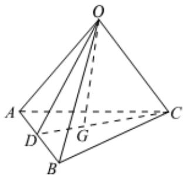

> [!faq]- 2022-2023学年内蒙古包头四中高二（上）期末数学试卷（理科）解析
>
> > [!success]- **【答案】** B
>
> > [!note]- **【解析】**
> > 四面体O-ABC中，G是底面△ABC的重心，连接CG并延长，交AB于D，
> >
> > 则 $D$ 为线段 $AB$ 的中点， $\overrightarrow{OD} = \frac{1}{2} (\overrightarrow{OA} +\overrightarrow{OB})$
> >
> > 由 $\overrightarrow{CG} = 2\overrightarrow{GD}$ ，可得 $\overrightarrow{OG} -\overrightarrow{OC} = 2(\overrightarrow{OD} -\overrightarrow{OG})$
> >
> > $$
> > \overrightarrow {O G} = \frac {1}{3} (\overrightarrow {O C} + 2 \overrightarrow {O D}) = \frac {1}{3} \overrightarrow {O C} + \frac {2}{3} \times \frac {1}{2} (\overrightarrow {O A} + \overrightarrow {O B}) = \frac {1}{3} \overrightarrow {O A}
> > $$
> >
> > 
> >
> > $$
> > + \frac {1}{3} \overrightarrow {O B} + \frac {1}{3} \overrightarrow {O C}
> > $$
> >
> > 由 $\overrightarrow{OA} = \overrightarrow{a}$ ， $\overrightarrow{OB} = \overrightarrow{b}$ ， $\overrightarrow{OC} = \overrightarrow{c}$
> >
> > $$
> > \overrightarrow {O G} = \frac {1}{3} \overrightarrow {a} + \frac {1}{3} \overrightarrow {b} + \frac {1}{3} \overrightarrow {c}
> > $$
> >
> > 故选：B.
