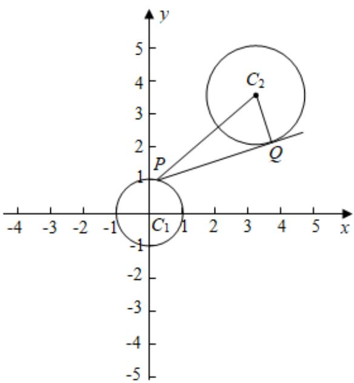

> [!faq]- 2022-2023学年内蒙古包头四中高二（上）期末数学试卷（理科）解析
>
> > [!success]- **【答案】** C
>
> > [!note]- **【解析】**
> > 因为 $|PQ|=\sqrt{|PC_{2}|^{2}-|C_{2}Q|^{2}}=\sqrt{|PC_{2}|^{2}-4}$
> >
> > $$
> > \left| P C _ {2} \right| \leq \left| C _ {1} C _ {2} \right| + 1 = \sqrt {3 ^ {2} + 4 ^ {2}} + 1 = 5 + 1 = 6
> > $$
> >
> > 所以 $|PQ| \leq \sqrt{6^{2} - 4} = 4\sqrt{2}$
> >
> > 即切线段PQ长的最大值为 $4\sqrt{2}$ .
> >
> > 故选：C.
> >
> > 
