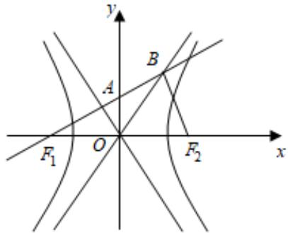

> [!faq]- 2022-2023学年内蒙古包头四中高二（上）期末数学试卷（理科）解析
>
> > [!success]- **【答案】** 2
>
> > [!note]- **【解析】**
> > 如图，
> >
> > 
> >
> > $\because \overrightarrow{F_1A} = \overrightarrow{AB},\therefore A$ 为 $F_{1}B$ 的中点，且 $O$ 为 $F_{1}F_{2}$ 的中点，
> >
> > ∴ AO 为 $\triangle F_{1}F_{2}B$ 的中位线
> >
> > 又∵ $\overrightarrow{F_{1}B}\bullet\overrightarrow{F_{2}B}=0,\therefore F_{1}B\perp F_{2}B$ ，则OB=F\_{1}O=c.
> >
> > 设 $B(x_{1},y_{1})$ ， $A(x_{2},y_{2})$ ，
> >
> > $\because$ 点 $B$ 在渐近线 $\pmb {y} = \frac{\pmb{b}}{\pmb{a}}\pmb{x}$ 上，
> >
> > $\therefore \left\{ \begin{array}{l} x_{1}^{2} + y_{1}^{2} = c^{2} \\ y_{1} = \frac{b}{a} x_{1} \end{array} \right.$ 得 $\left\{ \begin{array}{l} x_{1} = a \\ y_{1} = b \end{array} \right.$ .
> >
> > 又∵A为 $F_{1}B$ 的中点，∴ $\left\{\begin{aligned}x_{2}&=\frac{-c+a}{2}\\ y_{2}&=\frac{b}{2}\end{aligned}\right.$
> >
> > ∵ A 在渐近线 y = - $\frac{b}{a}$ x 上，
> >
> > $\therefore \frac{b}{2} = -\frac{b}{a} \cdot \frac{a - c}{2}$ ，得 $c = 2a$ ，则双曲线的离心率 $e = \frac{c}{a} = 2$ .
> >
> > 故答案为：2.
