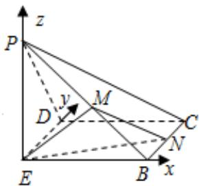

> [!faq]- 2022-2023学年内蒙古包头四中高二（上）期末数学试卷（理科）解析
>
> > [!success]- **【答案】** 详见解析
>
> > [!note]- **【解析】**
> > 详见解析
> >
> > (I)证明：由 $PE\perp EB$ ， $PE\perp ED$ ， $EB\cap ED=E$ ，
> > 所以 $PE\perp$ 平面EBCD，又 $BC\subset$ 平面EBCD，
> > 故 $PE\perp BC$ ，又 $BC\perp BE$ ，故 $BC\perp$ 平面PEB， $EM\subset$ 平面PEB，故 $EM\perp BC$ 又等腰三角形PEB， $EM\perp PB$ $BC\cap PB=B$ ，故 $EM\perp$ 平面PBC， $EM\subset$ 平面EMN，
> > 故平面 $EMN\perp$ 平面PBC：
> >
> > 
> >
> > (II)以 $E$ 为原点， $EB$ ，ED， $EP$ 分别为 $\pmb {x}$ ， $\pmb{y}$ ， $z$ 轴建立空间直角坐标系，
> >
> > $$
> > \text {设} P E = E B = 2, \text {设} N (2, m, 0), B (2, 0, 0), D (0, 2, 0), P (0, 0, 2), C (2, 2, 0), M (1, 0, 1)
> > $$
> >
> > $$
> > \overrightarrow {E M} = (1, 0, 1), \overrightarrow {E B} = (2, 0, 0), \overrightarrow {E N} = (2, m, 0)
> > $$
> >
> > 设平面EMN的法向量为 $\overrightarrow{m}=(x,y,z)$ ,
> >
> > $$
> > \left\{ \begin{array}{l l} {{\overrightarrow {m} \cdot \overrightarrow {E M} = x + z = 0}} \\ {{\overrightarrow {m} \cdot \overrightarrow {E N} = 2 x + m y = 0}} \end{array} \right., \mathrm{得} \overrightarrow {m} = \left(m, - 2, - m\right)
> > $$
> >
> > 平面 $BEN$ 的法向量为 $\overrightarrow{n} = (0, 0, 1)$ ，
> >
> > 故|cos < $\overrightarrow{m}$ , $\overrightarrow{n} > | = |\frac{-m}{\sqrt{2m^{2}+4}}| = \frac{\sqrt{6}}{6}$ ,
> >
> > 得m=1，
> >
> > 故存在N为BC的中点.
