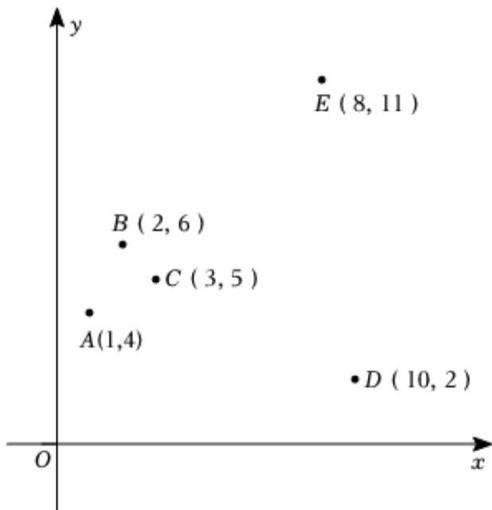

<!-- question-source:start -->
7、某兴趣小组研究光照时长 $x(h)$ 和向日葵种子发芽数量 $y(\text{颗})$ 之间的关系，采集5组数据，作如图所示的散点图.若去掉 $D(10,2)$ 后，下列说法正确的是（）

A 相关系数 $r$ 的绝对值变小  
B 相关指数 $R^2$ 变小  
C 残差平方和变大  
D 解释变量 $\pmb{x}$ 与响应变量 $\pmb{y}$ 的相关性变强
<!-- question-source:end -->

![[Q00090361A1]]
