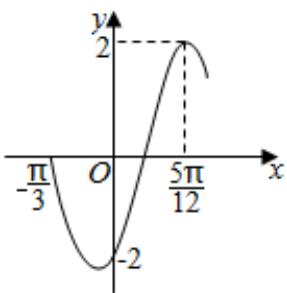

<!-- question-source:start -->
10、已知 $\tan \alpha$ ， $\tan \beta$ 是方程 $x^{2} + 3\sqrt{3} x + 4 = 0$ 的两个根，且 $-\frac{\pi}{2} < \alpha < \frac{\pi}{2}$ ， $-\frac{\pi}{2} < \beta < \frac{\pi}{2}$ ，则 $\alpha + \beta = ()$ A $\frac{\pi}{3}$ B $-\frac{2}{3}\pi$ C $\frac{\pi}{3}$ 或 $-\frac{2}{3}\pi$ D $-\frac{\pi}{3}$ 或 $\frac{2}{3}\pi$

<!-- question-source:end -->

![[Q00090364A1]]
