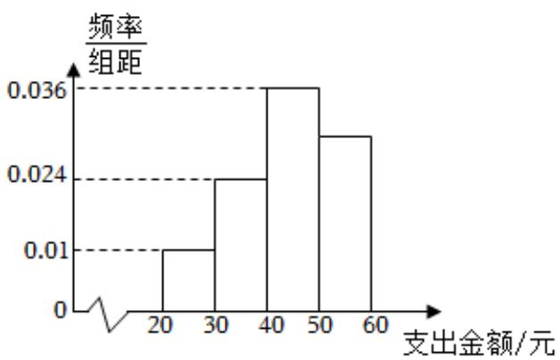

<!-- question-source:start -->
4、

某学校为了调查该校学生在一周零食方面的支出情况，抽出了一个容量为 $n$ 的样本，分成四组[20,30)，[30,40)，[40,50)，[50,60]，其频率分布直方图如图所示，其中支出在[50,60]元的学生有180人.

## 1 请求出 $n$ 的值；

2 请以样本估计全校学生的平均支出为多少元（同一组的数据用该区间的中点值作代表）；

3

如果采用分层抽样的方法从[30, 40)，[40, 50)共抽取5人，然后从中选取2人参加学校进一步的座谈会，求在[30, 40)，[40, 50)中正好各抽取一人的概率为多少.
<!-- question-source:end -->

![[Q00090374A1]]
