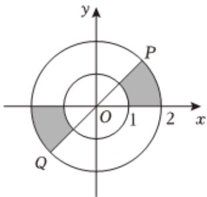

> [!faq]- 2022-2023学年内蒙古包头市铁路一中高二（下）期末数学试卷（文科）解析
>
> > [!success]- **【答案】** C
>
> > [!note]- **【解析】**
> > 如图， $PQ$ 为第一象限与第三象限的角平分线，
> >
> > 根据题意可得构成A的区域为圆环，
> >
> > 而直线 $OA$ 的倾斜角不大于 $\frac{\pi}{4}$ 的点 $A$ 构成的区域为图中阴影部分，
> >
> > ∴所求概率为 $\frac{2}{8}=\frac{1}{4}$ .
> >
> > 故选：C.
> >
> > 
