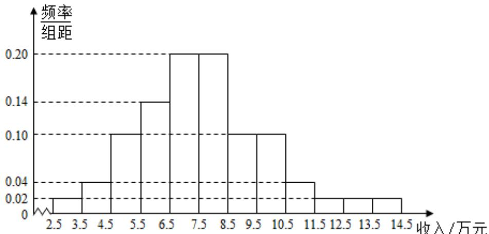

<!-- question-source:start -->
10、为了解某地农村经济情况，对该地农户家庭年收入进行抽样调查，将农户家庭年收入的调查数据整理得到如下频率分布直方图：

根据此频率分布直方图，下面结论中不正确的是（）
A 该地农户家庭年收入低于4.5万元的农户比率估计为6%
B 该地农户家庭年收入不低于10.5万元的农户比率估计为10%
C 估计该地农户家庭年收入的平均值不超过6.5万元
D 估计该地有一半以上的农户，其家庭年收入介于4.5万元至8.5万元之间
<!-- question-source:end -->

![[Q00090342A1]]
