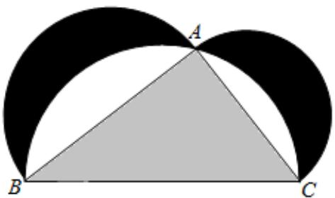

<!-- question-source:start -->
12、如图来自古希腊数学家希波克拉底所研究的几何图形.此图由三个半圆构成，三个半圆的直径分别为直角三角形ABC的斜边BC，直角边AB，AC.△ABC的三边所围成的区域记为I，黑色部分记为Ⅱ，其余部分记为Ⅲ.在整个图形中随机取一点，此点取自Ⅰ，Ⅱ，Ⅲ的概率分别记为 $p_{1}$ ， $p_{2}$ ， $p_{3}$ ，则（）

A $p_{1}=p_{2}$ B $p_{1}=p_{3}$ C $p_{2}=p_{3}$ D $p_{1}=p_{2}+p_{3}$

<!-- question-source:end -->

![[Q00090344A1]]
