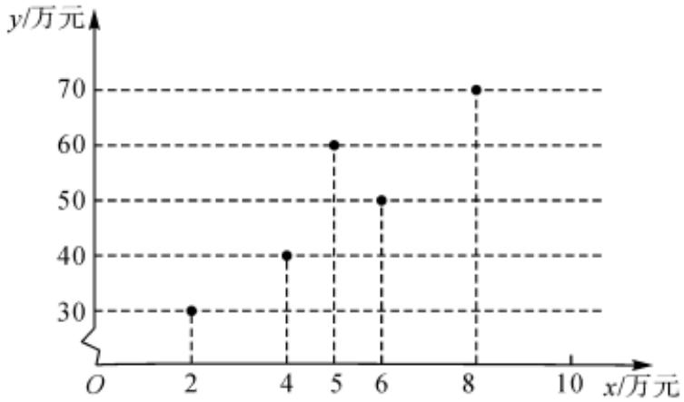

<!-- question-source:start -->
6、某商场为了考查商场一个月的商品销售额 $y$ （单位：万元）与广告费支出 $x$ （单位：万元）之间的相关关系，绘制了如图散点图.

  
1 由散点图求出 $y$ 关于 $\pmb{x}$ 的经验回归直线方程；

统计表明，该商场的某款广告在平台发布后，其商品日销售额x(单位：万元)近似地服从正态分布(5,1.69)，商场对员工的奖励方案如下：若日销售额不超过2.4万元，没有奖励；若日销售额超过2.4万元但不超过6.3万元，则每人奖励200元；若日销售额超过6.3万元，则每人奖励500元，试求该商场每名员工单日获得奖金的数学期望。(答案精确到整数）

附：参考公式：经验回归直线方程 $= x+$ 的斜率和截距的最小二乘估计分别为：

$$
\hat {b} = \frac {\sum_ {i = 1} ^ {n} (x _ {i} - \overline {{{x}}}) (y _ {i} - \overline {{{y}}})}{\sum_ {i = 1} ^ {n} (x _ {i} - \overline {{{x}}}) ^ {2}} = \frac {\sum_ {i = 1} ^ {n} x _ {i} y _ {i} - n \overline {{{x}}} \overline {{{y}}}}{\sum_ {i = 1} ^ {n} x _ {i} ^ {2} - n \overline {{{x}}} ^ {2}}, \hat {a} = \overline {{{y}}} - \hat {b} \overline {{{x}}},
$$

$$
\text {若} Z \sim N \left(\mu , \sigma^ {2}\right), \text {则} P (\mu - \sigma <   Z \leqslant \mu + \sigma) = 0. 6 8 2 7,
$$

$$
P (\mu - 2 \sigma <   Z \leqslant \mu + 2 \sigma) = 0. 9 5 4 5, P (\mu - 3 \sigma <   Z \leqslant \mu + 3 \sigma) = 0. 9 9 7 3.
$$
<!-- question-source:end -->

![[Q00090354A1]]
