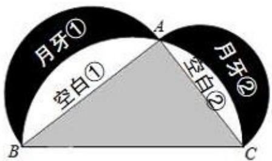

> [!faq]- 2022-2023学年内蒙古包头市铁路一中高二（下）期末数学试卷（理科）解析
>
> > [!success]- **【答案】** A
>
> > [!note]- **【解析】**
> > 法一：如图：设 $BC = 2r_{1}$ ， $AB = 2r_{2}$ ， $AC = 2r_{3}$
> >
> > $$
> > \therefore r _ {1} ^ {2} = r _ {2} ^ {2} + r _ {3} ^ {2},
> > $$
> >
> > $$
> > \therefore S _ {\mathrm{I}} = \frac {1}{2} \times 4 r _ {2} r _ {3} = 2 r _ {2} r _ {3}, S _ {\mathrm{III}} = \frac {1}{2} \times \pi r _ {1} ^ {2} - 2 r _ {2} r _ {3},
> > $$
> >
> > $$
> > S _ {\mathrm{II}} = \frac {1}{2} \times \pi r _ {3} ^ {2} + \frac {1}{2} \times \pi r _ {2} ^ {2} - S _ {\mathrm{III}} = \frac {1}{2} \times \pi r _ {3} ^ {2} + \frac {1}{2} \times \pi r _ {2} ^ {2} - \frac {1}{2} \times \pi r _ {1} ^ {2} + 2 r _ {2} r _ {3} = 2 r _ {2} r _ {3},
> > $$
> >
> > $\therefore S_{\mathrm{I}} = S_{\mathrm{II}}$
> >
> > $\therefore p_{1} = p_{2}$ 法二：设 $BC = 2r_1$ ， $AB = 2r_2$ ， $AC = 2r_3$ 则 $r_1^2 = r_2^2 +r_3^2$ $\therefore \frac{\pi r_1^2}{2} = \frac{\pi r_2^2}{2} +\frac{\pi r_3^2}{2},$ 故大半圆面积等于两个较小半圆面积之和，即 $S_{\mathrm{I}} + S_{\text{空白①}} + S_{\text{空白②}} = S_{\text{月牙①}} + S_{\text{空白①}} + S_{\text{月牙②}} + S_{\text{空白②}}$ $\therefore S_{\mathrm{I}} = S_{\text{月牙①}} + S_{\text{月牙②}}$ $\therefore S_{\mathrm{I}} = S_{\mathrm{II}}$ $\therefore p_1 = p_2$ 故选： $A$
> >
> > 
