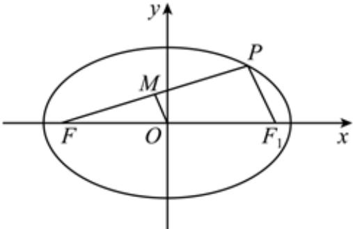

> [!faq]- 2022-2023学年内蒙古包头市高二（上）期末数学试卷（文科）解析
>
> > [!success]- **【答案】** C
>
> > [!note]- **【解析】**
> > 设 $F_{1}$ 为椭圆的右焦点，连接 $PF_{1}$ ，如图所示：
> >
> > 
> >
> > ∵ M 是线段 PF 的中点，O 为 $FF_{1}$ 的中点，
> >
> > $$
> > \therefore M O \mathbin {/ /} P F _ {1}, | O M | = \frac {1}{2} | P F _ {1} |
> > $$
> >
> > $$
> > \because | O M | = \frac {3}{4}, \therefore | P F _ {1} | = \frac {3}{2}
> > $$
> >
> > 又椭圆标准方程为 $\frac{x^2}{4} +\frac{y^2}{3} = 1$ ，则 $a = 2$
> >
> > 又由椭圆的定义得 $\left|PF\right|+\left|PF_{1}\right|=2a=4$ ，故 $\left|PF\right|=\frac{5}{2}$ ，
> >
> > 故选：C.
