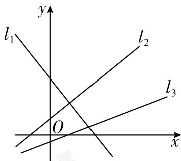

<!-- question-source:start -->
4. 三条直线 $l_{1}$ , $l_{2}$ , $l_{3}$ 的位置如图所示, 它们的斜率分别为 $k_{1}$ , $k_{2}$ , $k_{3}$ , 则 $k_{1}$ , $k_{2}$ , $k_{3}$ 的大小关系为（）.

A. $k_{2} > k_{1} > k_{3}$ B. $k_{2} > k_{3} > k_{1}$ C. $k_{3} > k_{2} > k_{1}$ D. $k_{3} > k_{1} > k_{2}$
<!-- question-source:end -->

![[Q00091415A1]]
