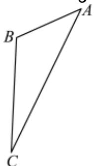

<!-- question-source:start -->
22. 如图, 游客从某旅游景区的景点A处下山至C处有两种路径。一种从A沿直线步行到C, 另一种是先从A沿索道乘缆车到B, 然后从B沿直线步行到C。现有甲、乙两位游客从A处下山, 甲沿AC匀速步行, 速度为 $50 \mathrm{~m} / \mathrm{min}$ 。在甲出发 $2 \mathrm{~min}$ 后, 乙从A乘缆车到B, 再从B匀速步行到C。假设缆车匀速直线运行的速度为 $100 \mathrm{~m} / \mathrm{min}$ , 山路AC长为 $2520 \mathrm{~m}$ , 经测量,

$\sin A = \frac{3}{5}, \sin C = \frac{5}{13}$ , $\angle B$ 为钝角.

(1)求索道AB的长度;

(2)求乙出发多少分钟后，乙在缆车上与甲的距离最短？最短距离为多少m（结果保留根号）？
<!-- question-source:end -->

![[Q00091433A1]]
