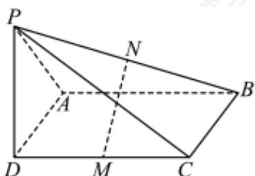

<!-- question-source:start -->
20. 如图，在四棱锥 $P - ABCD$ 中，底面ABCD是平行四边形， $M, N$ 分别为 $CD, PB$ 的中点。

(1)求证：MN//平面PAD;

(2)设 $PD \perp$ 平面 $ABCD$ , $PD = AD = 1$ , $AB = 2$ , 再从条件①、条件②这两个条件中选择一个作为已知, 求异面直线 $MN$ 与 $PC$ 所成角的余弦值.

条件①： $AB \perp MN$ ；条件②：AM = BM.

注：如果选择条件①和条件②分别解答，按第一个解答计分.
<!-- question-source:end -->

![[Q00092690A1]]
