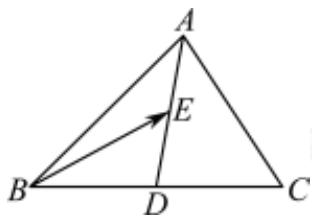

> [!faq]- 2022-2023学年内蒙古包头高一下学期期末数学试卷解析
>
> > [!success]- **【答案】** C
>
> > [!note]- **【分析】**
> > 根据平面向量的运算法则，化简得到 $\overrightarrow{BE} = -\frac{3}{4}\overrightarrow{AB} +\frac{1}{4}\overrightarrow{AC}$ ，求得
>
> > [!note]- **【解析】**
> > 如图所示，根据向量的线性运算法则，可得：
> >
> > $$
> > \overrightarrow {B E} = \overrightarrow {A E} - \overrightarrow {A B} = \frac {1}{2} \overrightarrow {A D} - \overrightarrow {A B} = \frac {1}{2} \cdot \left[ \frac {1}{2} \cdot (\overrightarrow {A B} + \overrightarrow {A C}) \right] - \overrightarrow {A B} = - \frac {3}{4} \overrightarrow {A B} + \frac {1}{4} \overrightarrow {A C}
> > $$
> >
> > 又因为 $\overrightarrow{BE} = \lambda \overrightarrow{AB} +\mu \overrightarrow{AC}$ ，所以 $\lambda = -\frac{3}{4},\mu = \frac{1}{4}$ ，所以 $\lambda -\mu = -1.$ 故选：C.
> >
> > 
