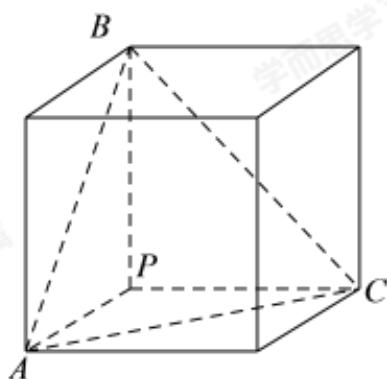

> [!faq]- 2022-2023学年内蒙古包头高一下学期期末数学试卷解析
>
> > [!success]- **【答案】** A
>
> > [!note]- **【分析】**
> > 依题意将正三棱锥放到正方体中，则正方体的外接球即为正三棱锥的外接球，正方体的体对角线即为外接球的直径，从而求出外接球的表面积.
>
> > [!note]- **【解析】**
> > 因为正三棱锥 $P - ABC$ 的侧棱 $PA, PB, PC$ 两两互相垂直，且
> >
> > $$
> > P A = P B = P C = a,
> > $$
> >
> > 如图将正三棱锥放到如下棱长为 $a$ 正方体中，则正三棱锥的外接球即为正方体的外接球，
> >
> > 则正方体的外接球的半径 $R = \frac{\sqrt{a^2 + a^2 + a^2}}{2} = \frac{\sqrt{3}a}{2}$
> >
> > 所以外接球的表面积 $S=4\pi R^{2}=4\pi\times\left(\frac{\sqrt{3}a}{2}\right)^{2}=3\pi a^{2}$
> >
> > 
> >
> > 故选：A
