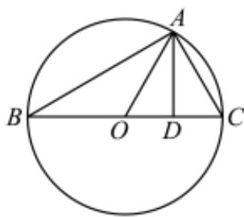

> [!faq]- 2022-2023学年内蒙古包头高一下学期期末数学试卷解析
>
> > [!success]- **【答案】** B
>
> > [!note]- **【分析】**
> > 根据题意得出BC为外接圆的直径，且△AOC是等边三角形，从而求出向量 $\overrightarrow{BA}$ 在向量 $\overrightarrow{BC}$ 上的投影向量.
>
> > [!note]- **【解析】**
> > $\because \triangle ABC$ 的外接圆的圆心为 $0$ ，且 $2\overrightarrow{AO} = \overrightarrow{AB} +\overrightarrow{AC},$
> >
> > ∴0为BC的中点，即BC为外接圆的直径，∴∠BAC=90°.
> >
> > $$
> > \because \left| \overrightarrow {O A} \right| = \left| \overrightarrow {A C} \right|,
> > $$
> >
> > $\therefore \triangle AOC$ 是等边三角形.
> >
> > 设 $D$ 为 $OC$ 的中点，则 $\overrightarrow{BD} = \frac{3}{4}\overrightarrow{BC}$ ∴向量 $\overrightarrow{BA}$ 在向量 $\overrightarrow{BC}$ 上的投影向量为
> >
> > $\left|\overrightarrow{BA}\right|\cos \angle ABC\cdot \frac{\overrightarrow{BC}}{\left|\overrightarrow{BC}\right|} = \frac{\left|\overrightarrow{BD}\right|}{\left|\overrightarrow{BC}\right|}\cdot \overrightarrow{BC} = \frac{3}{4}\overrightarrow{BC}.$
> >
> > 故选:B.
> >
> > 
