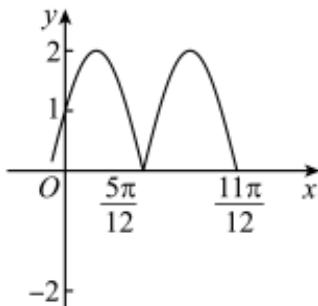

> [!faq]- 2022-2023学年内蒙古包头高一下学期期末数学试卷解析
>
> > [!success]- **【答案】** C
>
> > [!note]- **【分析】**
> > 根据图像得到相关未知量以及图像的变换即可得出答案.
>
> > [!note]- **【解析】**
> > 由图可知 $\frac{T}{2}=\frac{\pi}{2},\quad A=2,$ $\because T=\frac{2\pi}{\omega},$
> >
> > $\therefore \omega = 2,$ 此时 $f(x) = 2\sin (2x + \varphi),$ 令 $x = \frac{5\pi}{12},$ 则 $2\sin \left(\frac{5\pi}{6} +\varphi\right) = 0,$ $\therefore \frac{5\pi}{6} +\varphi = \pi +2k\pi ,k\in \mathbb{Z}$ $\therefore \varphi = 2k\pi +\frac{\pi}{6} (k\in Z),$ $\because 0 <   \varphi <  \frac{\pi}{2},$ $\therefore \varphi = \frac{\pi}{6},$ $\therefore f(x) = 2\sin \left(2x + \frac{\pi}{6}\right),$ 故A错误，B正确；
> >
> > 
> >
> > 由图可知 $|f(x)|$ 的周期为 $\frac{\pi}{2}$ ,
> >
> > 故C正确；
> >
> > 将函数 $y = 2\sin 2x$ 的图象向左平移 $\frac{\pi}{6}$ 得
> >
> > $y' = 2 \sin[2(x + \frac{\pi}{6})] = 2 \sin(2x + \frac{\pi}{3})$ ，与 $f(x)$ 不同，故D错误.
