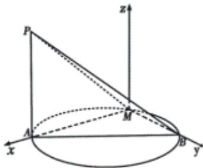

> [!faq]- 2022-2023学年内蒙古包头高一下学期期末数学试卷解析
>
> > [!success]- **【答案】** 详见解析
>
> > [!note]- **【解析】**
> > 详见解析
> >
> > 解：（1）设点A到平面PBM的距离为d，
> > 由题意知 $BM\perp AM$ ， $BM\perp PA$ ， $AM\cap PA=A$ ，
> > 则BM⊥面PAM，所以BM⊥PM.
> > 由 $V_{A-PBM}=V_{P-ABM}$ ，得 $\frac{1}{3}S_{\triangle PBM}\cdot d=\frac{1}{3}S_{\triangle ABM}\cdot PA,$ $\frac{1}{2}PM\cdot BM\cdot d=\frac{1}{2}AM\cdot BM\cdot3,\sqrt{17}d=6\sqrt{2}$ ，故 $d=\frac{6\sqrt{34}}{17}$ .
> > 所以点A到平面PBM的距离为 $\frac{6\sqrt{34}}{17}$ .
> >
> > (2) 以 $M A, M B$ , 过 $M$ 作 $A P$ 平行线所在直线分别为 $x, y, z$ 轴建立空间直角坐标系 $M - x y z$ , 如图所示.
> >
> > $$
> > P (2 \sqrt {2}, 0, 3)
> > $$
> >
> > 则 $\overrightarrow{MB} = (0, 2\sqrt{2}, 0)$ ， $\overrightarrow{MP} = (2\sqrt{2}, 0, 3)$ 。设平面 $PBM$ 的一个法向量为 $\vec{m} = (x, y, z)$ ，
> >
> > 由 $\vec{m} \cdot \overrightarrow{MB} = 0, \vec{m} \cdot \overrightarrow{MP} = 0$ 得 $y = 0, 2\sqrt{2} x + 3z = 0$ ，可取 $\vec{m} = (3, 0, -2\sqrt{2})$ .
> >
> > 取平面ABM的法向量 $\vec{n}=(0,0,1)$ ，则
> >
> > $$
> > \cos \langle \vec {m}, \vec {n} \rangle = \frac {\vec {m} \cdot \vec {n}}{| \vec {m} | | \vec {n} |} = - \frac {2 \sqrt {2}}{\sqrt {1 7}} = - \frac {2 \sqrt {3 4}}{1 7}.
> > $$
> >
> > 所以二面角A-BM-P的正弦值为 $\frac{3\sqrt{17}}{17}$ .
> >
> > 
