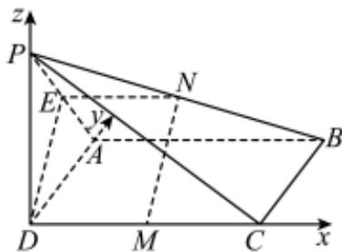

> [!faq]- 2022-2023学年内蒙古包头高一下学期期末数学试卷解析
>
> > [!success]- **【答案】** 详见解析 (2)条件选择见解析，余弦值为 $\frac{\sqrt{10}}{10}$
>
> > [!note]- **【分析】**
> > （1）取 $PA$ 中点 $\pmb{E}$ ，连接 $DE, EN$ ，证得 $MN // DE$ ，结合线面平行的判定定理，即可求解；
>
> > [!note]- **【解析】**
> > (1) 证明: 取 $PA$ 中点 $\pmb{E}$ , 连接 $DE, EN$ ,
> >
> > 因为M,N分别为CD,PB的中点，则 $EN//AB$ 且EN= $\frac{1}{2}AB$ .
> >
> > 又因为 $DM \parallel AB$ 且 $DM = \frac{1}{2} AB$ ，则 $EN \parallel DM$ ，且 $EN = DM$
> >
> > 所以DENM平行四边形，则MN//DE，
> >
> > 因为MN ∉面PAD，DE ⊂面PAD，所以MN//平面PAD.
> >
> > (2) 若选条件①: 由 $AB \perp MN$ , 因为 $MN // DE$ , 则 $AB \perp DE$ .
> >
> > 又由 $AB \perp PD$ ， $DE \cap PD = D$ 且 $DE, PD \subset$ 平面 $PAD$ ，所以 $AB \perp$ 平面 $PAD$ ，
> >
> > 因为 $AB // CD$ ，所以 $CD \perp$ 平面 $PAD$ ，
> >
> > 以D为原点，以DC, DA, DP所在直线分别为x，y，z轴建立空间直角坐标系D-xyz，
> >
> > 如图所示,则 $P(0,0,1)$ ， $C(2,0,0)$ ， $A(0,1,0)$ ，故 $\overrightarrow{PC}=(2,0,-1)$ .
> >
> > 又由 $\overrightarrow{MN} = \overrightarrow{DE} = \frac{1}{2} (0,1,1)$ ，则
> >
> > $$
> > \cos \Bigl \langle \stackrel {\rightarrow} {P C}, \stackrel {\rightarrow} {M N} \Bigr \rangle = \frac {\stackrel {\rightarrow} {P C} \cdot \stackrel {\rightarrow} {M N}}{\left| \stackrel {\rightarrow} {P C} \right|\left| \stackrel {\rightarrow} {M N} \right|} = - \frac {\sqrt {1 0}}{1 0}.
> > $$
> >
> > 所以异面直线MN与PCPC所成角的余弦值为 $\frac{\sqrt{10}}{10}$
> >
> > 若选条件②：由 $AM = BM$ ，可得 $\triangle ADM \cong \triangle BCM$ ，所以 $\angle ADM = \angle BCM$
> >
> > 又由 $AD \parallel BC$ ，所以 $\angle ADM + \angle BCM = 180^{\circ}$ ，
> >
> > 所以 $\angle ADM = \angle BCM = 90^{\circ}$ ，即 $CD\bot AD$
> >
> > 又由 $PD \perp$ 平面ABCD，且 $CD \subset$ 平面ABCD，所以 $CD \perp PD$
> >
> > 因为 $AD \cap PD = D$ ，且 $AD, PD \subset$ 平面 $PAD$ ，所以 $CD \perp$ 平面 $PAD$
> >
> > 以D为原点，以DC, DA, DP所在直线分别为x，y，z轴建立空间直角坐标系D-xyz，
> >
> > 如图所示,则 $P(0,0,1)$ ， $C(2,0,0)$ ， $A(0,1,0)$ ，故 $\overrightarrow{PC}=(2,0,-1)$ .
> >
> > 又由 $\overrightarrow{MN} = \overrightarrow{DE} = \frac{1}{2} (0,1,1)$ ，则
> >
> > $$
> > \cos \left\langle \overrightarrow {P C}, \overrightarrow {M N} \right\rangle = \frac {\overrightarrow {P C} \cdot \overrightarrow {M N}}{\left| \overrightarrow {P C} \right| \left| \overrightarrow {M N} \right|} = - \frac {\sqrt {1 0}}{1 0}.
> > $$
> >
> > 所以异面直线MN与PCPC所成角的余弦值为 $\frac{\sqrt{10}}{10}$
> >
> > 
