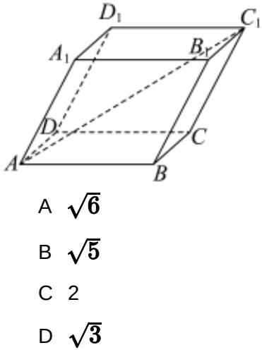

<!-- question-source:start -->
8、已知点 $M(x,y)(x\neq 0)$ 满足方程 $\sqrt{x^2 + (y + 1)^2} +\sqrt{x^2 + (y - 1)^2} = 4$ ，点 $A(0, - 2),B(0,2)$ .若 $MA$ 斜率为 $k_{1},MB$ 斜率为 $k_{2}$ ，则 $k_{1}\cdot k_{2}$ 的值为（）A- $\frac{4}{3}$ B- $\frac{3}{4}$ C- $\frac{1}{2}$ D-2

<!-- question-source:end -->

![[Q00091619A1]]
