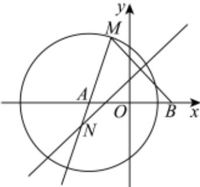
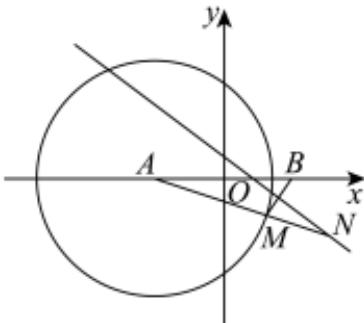

<!-- question-source:start -->
3、如图1、2，已知圆 $A$ 方程为 $(x + 2)^2 + y^2 = 12$ ，点 $B(2,0)$ . $M$ 是圆 $A$ 上动点，线段 $MB$ 的垂直平分线交直线 $MA$ 于点 $N$ ：

  
图1

  
图2

1 求点 $N$ 的轨迹方程；

2

记点 $N$ 的轨迹为曲线 $\Gamma$ ，过点 $P\left(\frac{3}{2},\frac{1}{2}\right)$ 是否存在一条直线 $l$ ，使得直线 $l$ 与曲线 $\Gamma$ 交于两点 $C$ 、 $D$ ，且 $P$ 是线段 $CD$ 中点．
<!-- question-source:end -->

![[Q00091630A1]]
