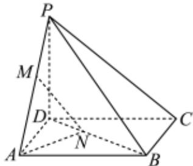

<!-- question-source:start -->
4、如图，已知四棱锥 $P - ABCD$ 中， $ABCD$ 是正方形， $PD \perp$ 平面 $ABCD$ ，点 $M$ 、 $N$ 分别是棱 $PA$ 、对角线 $BD$ 上的动点（不是端点），满足 $PM = DN$ 。

1 证明： $MN \parallel$ 平面PDC；

2 求 $M$ 、 $N$ 距离的最小值，并求此时二面角 $M - NA - D$ 的正弦值.
<!-- question-source:end -->

![[Q00091631A1]]
